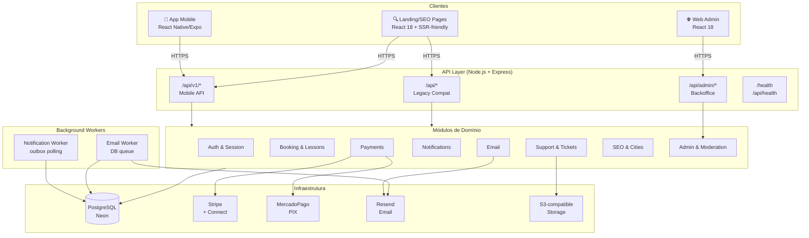
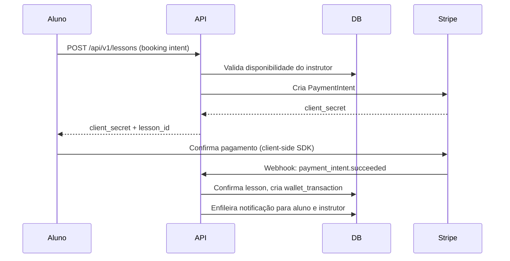
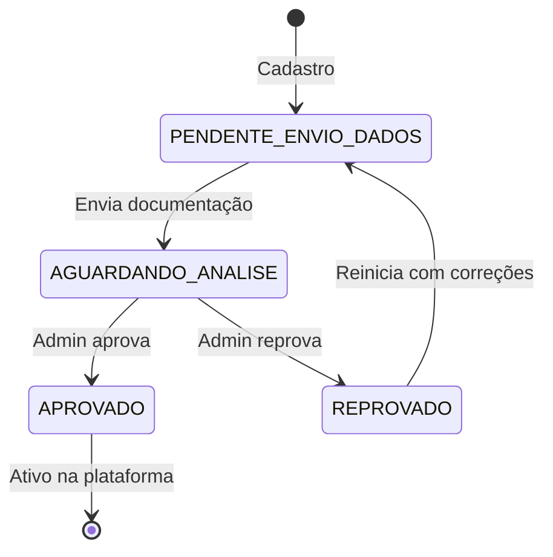

# System Design — HabilitaGO

## Visão Geral

HabilitaGO é um monorepo TypeScript com três camadas principais: frontend web, API backend e banco de dados. A experiência principal do usuário (aluno e instrutor) é mobile-first via app React Native/Expo.

---

## Diagrama de Arquitetura



---

## Componentes

### Client Layer

| Componente | Tecnologia | Responsabilidade |
|-----------|-----------|-----------------|
| App Mobile | React Native + Expo | Experiência principal do aluno e instrutor |
| Web Admin | React 18 + TypeScript | Dashboard de operações e moderação |
| Landing/SEO | React 18 + SSR-friendly | Páginas públicas e SEO por cidade/estado |

### API Layer

```
server/
├── index.ts              # Entry point, Express setup
├── routes.ts             # Router principal
├── routes/
│   ├── v1/               # API mobile versionada
│   ├── admin/            # Rotas do backoffice
│   └── mobile-compat.ts  # Compatibilidade mobile legada
├── modules/
│   ├── notifications/    # Controller + Service + Repo + Worker
│   └── email/            # Controller + Service + Repo + Worker
├── services/
│   └── storage/          # Adapter: Local + S3
├── config/               # Configuração centralizada
└── env/                  # Validação de variáveis de ambiente
```

### Database Layer

PostgreSQL via Neon (serverless), acessado com Drizzle ORM (type-safe, sem raw SQL fora de migrações).

**Principais entidades:**
- `users` — alunos, instrutores, admins
- `instructor_profiles` — perfis públicos e privados de instrutores
- `lessons` — agendamentos e histórico de aulas
- `payments` / `wallet_transactions` — ledger financeiro
- `reviews` — avaliações dos alunos
- `notifications` — inbox e campanhas
- `email_messages` — fila de e-mail com lifecycle
- `cities` / `states` — dados geográficos para SEO
- `support_tickets` / `ticket_attachments` — suporte

---

## Fluxos Críticos

### Booking (Aluno → Aula)



### Onboarding do Instrutor



---

## Decisões de Arquitetura

### Por que monorepo?
Compartilhamento de tipos, schemas Zod e validações entre frontend e backend sem duplicação. Garante contratos de API type-safe.

### Por que Drizzle ORM?
Type-safety completa com inferência de tipos do schema. SQL legível, sem magic. Migrations explícitas.

### Por que PostgreSQL (Neon)?
Transações ACID para pagamentos e bookings. Neon serverless reduz overhead operacional com escala automática.

### Por que workers separados?
Notificações e e-mails são assíncronos por natureza. Workers com outbox polling + `FOR UPDATE SKIP LOCKED` garantem at-least-once delivery sem duplicação, mesmo com múltiplas instâncias.

### Por que Stripe Connect?
Modelo de marketplace: HabilitaGO captura o pagamento e repassa para o instrutor. Stripe Connect gerencia compliance financeiro (KYC) do lado do instrutor.
